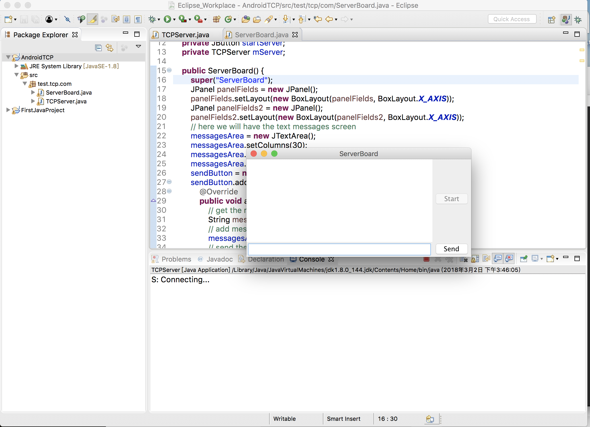
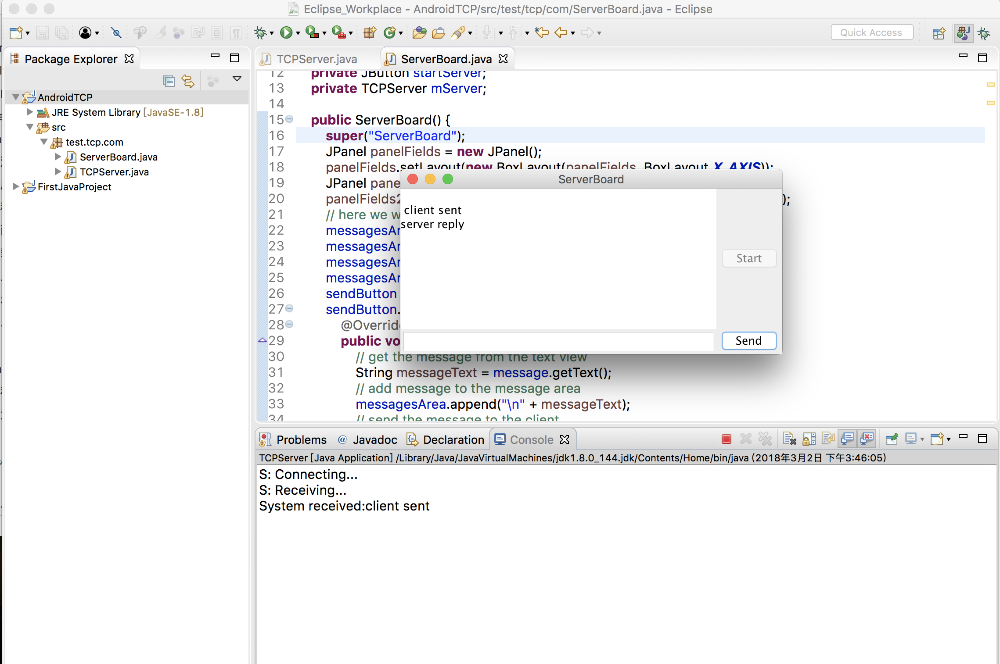
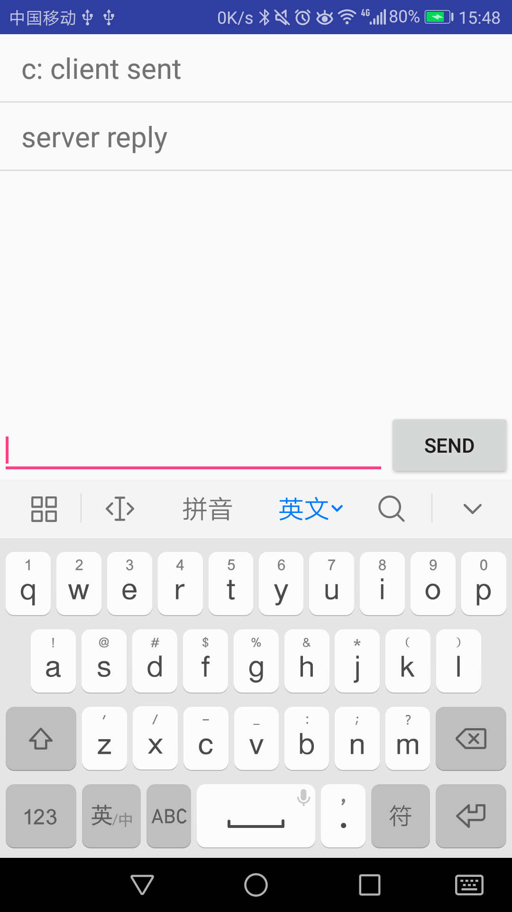

# 测试 Android TCP 连接的建立和数据的发送.

> 参考: [https://www.myandroidsolutions.com/2012/07/20/android-tcp-connection-tutorial/#.Wpjr_RNuaF0](https://www.myandroidsolutions.com/2012/07/20/android-tcp-connection-tutorial/#.Wpjr_RNuaF0)
> 
> 该项目是服务器端的项目.
>
>Client Android 端的地址为: [https://github.com/ghzjtian/TCP_Android](https://github.com/ghzjtian/TCP_Android)


### 1.运行的环境
* 1.MacBook Pro (13-inch, 2016, Four Thunderbolt 3 Ports)
* 2.java version:

```
MBP:~ tianzeng$ java -version
java version "1.8.0_144"
Java(TM) SE Runtime Environment (build 1.8.0_144-b01)
Java HotSpot(TM) 64-Bit Server VM (build 25.144-b01, mixed mode)
```

* 3.Eclipse ifo

```
Eclipse IDE for Java Developers

Version: Oxygen.1a Release (4.7.1a)
Build id: 20171005-1200
```

### 2.开始运行的步骤

* 1.点击 Start,等等 Client 的连接.
* 2.当连接建立后，即可发送数据.


### 3.相关的截图

* 1.点击开始后，等等 Client 的连接.


* 2.连接建立后，数据的发送及 Android 端的显示.





